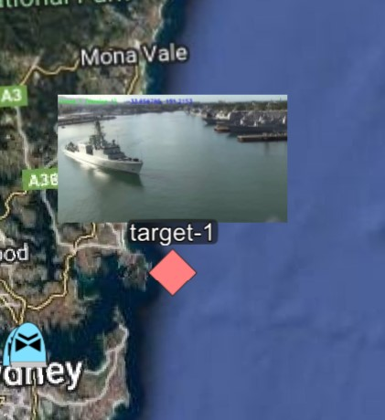

Static Image Overlays in WinTAK provide functionality where a user in a TAK Client is able to hover over a point marker, and see it's attachment display above the marker in a small window. Example Below:



In order to provide Static Image Overlays in a TAK Client, the following steps must be followed:

### Step 1: Update TAK Client to Version 4.4 or Greater

- The Public WinTAK can be downloaded from here [WinTAK v4.4](https://tak.gov/products)

### Step 2: Generate Data Package Payload

- A Data Package needs to be generated and uploaded for storage in the FreeTAK Server
- In order to do this, the Data Package needs to have the following structure:
  - 1 Folder titled with a `UID` (All uppercase)
    - Inside this folder, place a CoT XML File. This XML file will be used to place a marker on the map when read by a TAK Client. For Example:

    - ```xml
        <?xml version="1.0" encoding="utf-8" standalone="yes"?>
        <event version="2.0" uid="1793BD2E-28A9-46A7-83CF-670F6BBD3347" type="a-h-S-C" time="2022-02-17T02:20:13.00Z" start="2022-02-17T02:25:11.95Z" stale="2022-02-24T02:25:11.95Z" how="h-g-i-g-o">
        <point lat="-37.8253618" lon="144.9640203" hae="9999999" ce="9999999" le="9999999" />
        <detail>
            <contact callsign="Suspect Vessel" />
            <archive />
            <usericon iconsetpath="COT_MAPPING_2525B/a-h/a-h-G" />
        </detail>
        </event>
      ```

    - *Note: This CoT XML file extension must be .cot, not .xml*
    - Place the Image you will be using for the overlay inside this folder as well
  - 1 Folder titled `MANIFEST` (All uppercase)
    - Inside this folder, an XML File titled `manifest.xml` (*Note: This filename is case sensitive, and must be named manifest.xml in all lowercase*) needs to be created. The Manifest will tell the TAK what each item in the folder is. Sample Manifest:

    - ```xml
        <MissionPackageManifest version="2">
        <Configuration>
            <!-- Enter the FOLDER-UID Created in the previous step here -->
            <Parameter name="uid" value="FOLDER-UID" />
            <Parameter name="name" value="Suspect Vessel" />
            <Parameter name="onReceiveAction" value="com.atakmap.android.attachment.ATTACHMENT_RECEIVED" />
            <Parameter name="onReceiveDelete" value="true" />
            <Parameter name="onReceiveImport" value="true" />
            <Parameter name="callsign" value="Suspect Vessel" />
        </Configuration>
        <Contents>
            <!-- Enter the FOLDER-UID/COT-Filename created in the previous step here -->
            <Content zipEntry="FOLDER-UID/COT-FILENAME.cot" ignore="false">
            <Parameter name="uid" value="FOLDER-UID" />
            <Parameter name="isCOT" value="true" />
            </Content>
            <!-- Enter the FOLDER-UID/IMAGE-Filename created in the previous step here -->
            <Content zipEntry="FOLDER-UID/IMAGE-FILENAME.jpg"  ignore="false">
            <Parameter name="uid" value="FOLDER-UID" />
            <Parameter name="isCOT" value="false" />
            <Parameter name="contentType" value="image/jpg" />
            </Content>
        </Contents>
        </MissionPackageManifest>
      ```

    - If using the sample manifest as a template, please ensure to populate the required values for Folder-UID, COT-FileName and Image-FileName
- Once both folders have been created, place both into a ZIP File and generate a `SHA256` Hash of the file. Save this hash, as it will be required in future steps.

### Step 3: Upload Data Package to FreeTAK

- FreeTAK has a set of API's which let you upload packages. In order to upload a data package and make it available for clients, 2 API Calls need to be made.
- The First API Call:

  - ```bash
      curl --location --request POST 'http://20.40.81.168:8080/Marti/sync/missionupload?hash=518AAA62ED263371DBD9C6E647CC1057EE02D8170468EBDCED9277DCF383237D&filename=SuspectVessel.zip&creatorUid=S-1-12-1-3807762983-1169496742-1797301920-1838764222' \
      --header 'Content-Disposition: form-data;name="assetfile";filename="SuspectVessel.zip"' \
      --form 'assetfile=@"./SuspectVessel.zip"'
     ```

    - *Replace the IP Address with the IP Address of your FreeTAK Server*
    - *Replace the hash query param with the hash of the zip file generated in the previous step*
    - *Ensure the form and header parameters have the correct filenames, and are pointing to the location of the zip file*

- The Second API Call:

  - ```bash
        curl --location --request PUT 'http://20.40.81.168:8080/Marti/api/sync/metadata/518AAA62ED263371DBD9C6E647CC1057EE02D8170468EBDCED9277DCF383237D/tool'
    ```

  - *Replace the IP Address with the IP Address of your FreeTAK Server*
  - *Replace the hash value with with the same hash used in the previous step*

### Step 4: Send Final CoT Payload to WinTAK

- The Final step is to send a Binary File Transfer Request to WinTAK. This will tell WinTAK to grab the data package that was uploaded in the previous step, unpack it and display the contents. The Payload that needs to be sent looks like this:

- ```xml
  <?xml version="1.0" encoding="UTF-8"?>
  <event version="2.0" uid="a030e580-4942-4f4c-ad67-56d7b6b5c39c" type="b-f-t-r" time="2022-02-17T04:47:20.606Z" start="2022-02-17T04:47:20.606Z" stale="2022-02-17T04:47:30.606Z" how="h-e">
    <point lat="-38.02963571" lon="145.20476069" hae="9999999" ce="9999999" le="9999999"/>
    <detail>
        <fileshare filename="Suspect Vessel_45X9C" senderUrl="http://20.40.81.168:8080/Marti/api/sync/metadata/518AAA62ED263371DBD9C6E647CC1057EE02D8170468EBDCED9277DCF383237D/tool" sizeInBytes="73733" sha256="518AAA62ED263371DBD9C6E647CC1057EE02D8170468EBDCED9277DCF383237D" senderUid="S-1-12-1-3807762983-1169496742-1797301920-1838764222" senderCallsign="LAITY" name="Suspect Vessel" />
        <ackrequest uid="e20e8a49-a548-4344-ad3d-091588590cf9" ackrequested="true" tag="Suspect Vessel" />
    </detail>
    </event>
  ```

- *Note: The type must be `b-f-t-r` in order for the data packages to be displayed*
- Replace the `senderUrl` attribute with the url used in the 2nd API Call during the previous step
- Replace the `sha256` attribute with the hash value generated in the earlier steps

You should now see the payload appear on WinTAK, and should be able to hover over the payload to see the image popup.